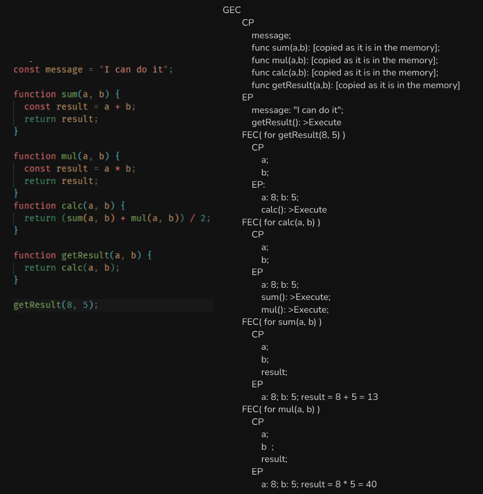
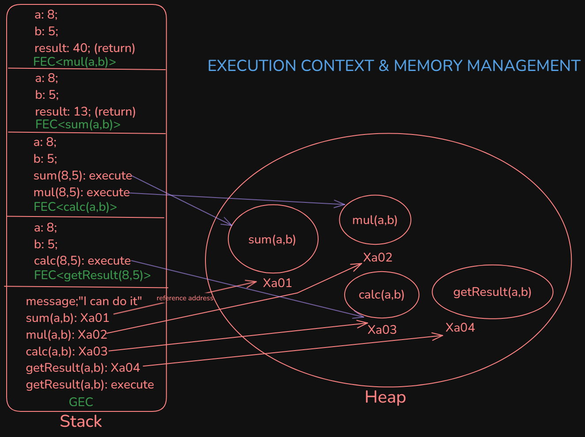
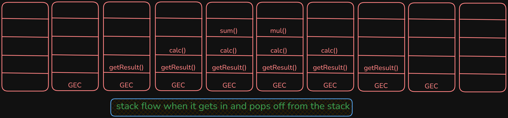

# Global Execution Context(GCE) & Function Execution Context with its two phases by which it executes a program, "creation phase" and "execution phase solve".

## This image demonstrates how javascript execution happens when the code runs

# EXECUTION CONTEXT WITH MEMORY MANAGEMENT (Stack and Heap Flow)

## This image demonstrates how javascript handles a lot of execution scenarios

# STACK DIAGRAM

## This is the stack flow when it gets in and pops off from the stack

